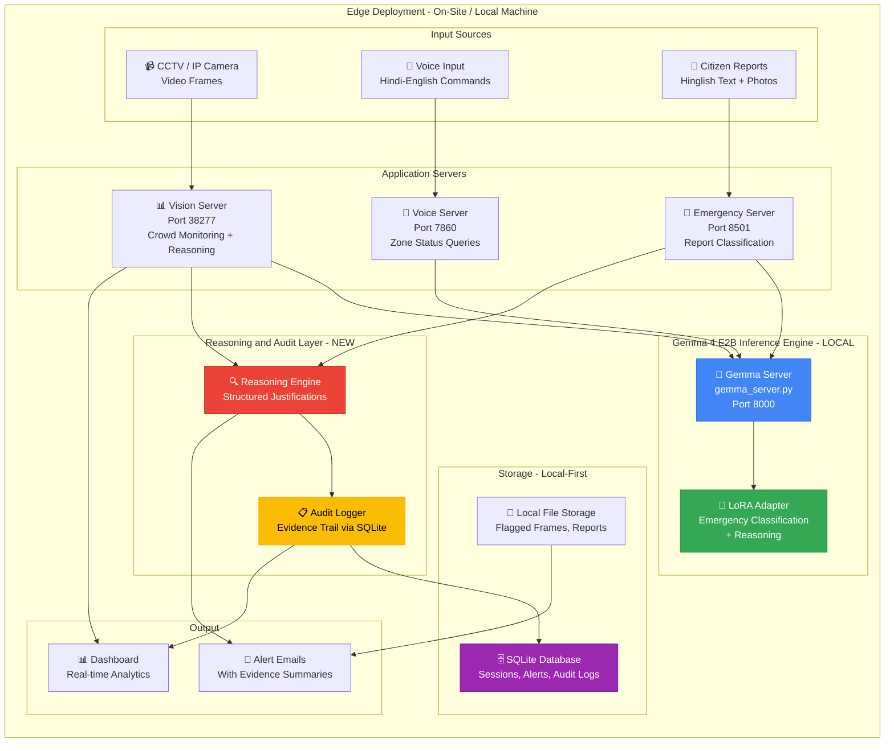
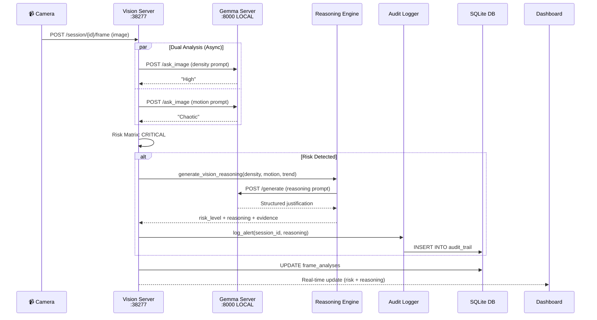
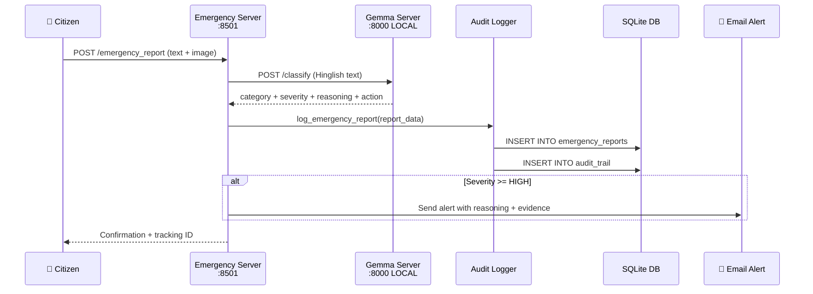

# Gemma Kavach v2 — Design & Architecture Document

> **Hackathon**: Google Gemma 4 Impact Challenge (Track 2: AI for Public Safety)
> **Date**: July 2026
> **Base Repo**: [gemma-kavach](file:///c:/Users/Faaiz/Desktop/gemma/gemma-kavach)
> **Core Model**: Gemma 4 E2B (open-weight, LoRA fine-tuned on Kaggle)

---

## 1. Executive Summary

Gemma Kavach v2 is a **privacy-preserving, on-device AI crowd safety system** that uses a fine-tuned **Gemma 4 E2B** model to monitor crowds, classify citizen emergency reports, and generate **auditable evidence trails** for every alert. It directly addresses the two critical failures identified in the Track 2 problem statement:

| Problem Statement Pain Point | Original Repo (v1) | Gemma Kavach v2 (This Build) |
|---|---|---|
| Cloud-based processing creates latency & privacy risks | ❌ RunPod cloud GPU inference | ✅ **On-device / local inference** — no data leaves the site |
| Black-box pattern matching lacks reasoning layer | ❌ Density × Motion lookup table | ✅ **Reasoning-augmented classification** — every alert has a structured justification |
| Alarm fatigue from high-noise surveillance | ❌ No benchmarks | ✅ **False-positive benchmark** comparing baseline vs. Gemma reasoning |

---

## 2. Problem Statement & Gap Analysis

### 2.1 Track 2 Problem Framing

> *"Traditional public safety monitoring suffers from 'alarm fatigue' due to passive, high-noise surveillance that lacks semantic context. Current systems face two critical failures: reliance on cloud-based processing creates latency and privacy risks, while 'black-box' pattern matching lacks the reasoning layer needed for reliable, forensic-grade verification."*

### 2.2 Gaps in the Original Repo

The existing [gemma-kavach](file:///c:/Users/Faaiz/Desktop/gemma/gemma-kavach) repo has real, working ML work — a multi-service system with vision, voice, text, and a fine-tuning pipeline. But it misses the **two specific things the problem statement tests for**:

#### Gap 1: Cloud Dependency
- The [GemmaServer](file:///c:/Users/Faaiz/Desktop/gemma/gemma-kavach/GemmaServer) runs on **RunPod** (cloud GPU, RTX 4090).
- The [Vision Server routes](file:///c:/Users/Faaiz/Desktop/gemma/gemma-kavach/Gemma_Kavach_Vision_Server/routes.py) hardcode the RunPod proxy URL:
  ```python
  GEMMA_API_URL = "https://l63p034w6181jc-8000.proxy.runpod.net/ask_image"
  ```
- The [Voice Server](file:///c:/Users/Faaiz/Desktop/gemma/gemma-kavach/Gemma_Kavach_Voice_Server/utils.py) does the same.
- **All inference data transits the public internet** — the exact anti-pattern the problem statement criticizes.

#### Gap 2: No Reasoning Layer
- Risk assessment in [routes.py](file:///c:/Users/Faaiz/Desktop/gemma/gemma-kavach/Gemma_Kavach_Vision_Server/routes.py) is a static lookup table:
  ```
  High + Chaotic → CRITICAL
  Medium + Chaotic → HIGH
  ...
  ```
- The emergency classifier in [User_Chat_Server/utils.py](file:///c:/Users/Faaiz/Desktop/gemma/gemma-kavach/User_Chat_Server/utils.py) outputs a bare label (`child_lost`, `crowd_panic`, etc.) with **zero justification**.
- No chain-of-evidence, no timestamps, no audit trail. This is still "black-box pattern matching."

#### Gap 3: No Alarm Fatigue Evidence
- No benchmark comparing false-positive rates before vs. after Gemma reasoning.
- The `>95% accuracy` claim is on **synthetic data** — not adversarial or real-world.

---

## 3. Design Goals

| # | Goal | Success Criteria |
|---|---|---|
| G1 | **On-device inference** | Gemma 4 E2B runs locally; no RunPod/cloud dependency for core AI |
| G2 | **Reasoning per alert** | Every alert includes a structured justification (what changed, why it's unsafe, evidence) |
| G3 | **Auditable evidence trail** | Timestamped log of every alert with frame refs, risk score, and reasoning text |
| G4 | **Alarm fatigue reduction** | Benchmark: X% fewer false positives vs. baseline (density×motion table alone) |
| G5 | **Hinglish emergency classification** | Fine-tuned Gemma 4 E2B classifies citizen reports with category + reasoning |
| G6 | **India-specific UX** | Hindi/English voice, Hinglish text, festival/mela context |

---

## 4. System Architecture

### 4.1 High-Level Architecture



### 4.2 Key Architectural Decisions

| Decision | Choice | Rationale |
|---|---|---|
| **Model** | Gemma 4 E2B (not 4B) | E2B needs ~8-10GB VRAM with LoRA, fits consumer GPUs and Kaggle T4s. 4B needs ~17GB. |
| **Fine-tuning** | LoRA on Kaggle (free T4 x2) | Kaggle provides free GPUs; Unsloth has official E2B notebook. Cost = $0. |
| **Inference** | Local GPU (4-bit quantized) | Eliminates cloud dependency; a LoRA-tuned E2B in 4-bit runs on an 8GB+ GPU. |
| **Storage** | SQLite (replaces CSV) | Atomic writes, concurrent reads, schema enforcement. CSV is not a database. |
| **Reasoning** | Model generates justification per alert | Single LoRA fine-tune produces classification + reasoning in one forward pass. |
| **Audit** | Append-only log table in SQLite | Immutable evidence trail: timestamp, frame_ref, risk_score, reasoning_text. |

### 4.3 Component-Level Architecture

#### 4.3.1 Gemma Server (Modified)

**Current** ([gemma_loader.py](file:///c:/Users/Faaiz/Desktop/gemma/gemma-kavach/GemmaServer/gemma_loader.py)): Loads `unsloth/gemma-3n-E4B-it` from Unsloth, serves via FastAPI on `:8000`.

**v2 Changes**:
- Model swapped to `Gemma 4 E2B` (open weights from HuggingFace/Kaggle Models)
- LoRA adapter loaded for emergency classification + reasoning
- Runs **locally** — `SERVER_URL = "http://localhost:8000"` (not RunPod)
- New `/classify` endpoint that returns `{classification, reasoning, confidence}`

```
gemma_server.py (v2)
├── /generate           → Text generation (existing)
├── /ask_image          → Image + prompt → text (existing)
├── /ask                → Audio + prompt → text (existing)
├── /classify           → Emergency text → {category, reasoning}  ← NEW
└── /health             → Health check (existing)
```

#### 4.3.2 Vision Server (Modified)

**Current** ([routes.py](file:///c:/Users/Faaiz/Desktop/gemma/gemma-kavach/Gemma_Kavach_Vision_Server/routes.py)): Sends frames to RunPod, gets density/motion labels, applies static risk matrix.

**v2 Changes**:
- Points to `localhost:8000` instead of RunPod
- After density+motion classification, calls Gemma to **generate a reasoning justification** for flagged frames
- Reasoning output structure:

```json
{
  "risk_level": "CRITICAL",
  "reasoning": "Flagged as CRITICAL: crowd density spiked from Medium to High over 3 consecutive frames. Motion pattern shows radial dispersion consistent with panic behavior, not routine ingress/egress. High-density zones concentrated in NE quadrant of frame.",
  "evidence": {
    "density_trend": ["Medium", "Medium", "High", "High"],
    "motion_trend": ["Calm", "Calm", "Chaotic", "Chaotic"],
    "time_window_seconds": 8,
    "frame_refs": [12, 13, 14, 15]
  },
  "timestamp": "2026-07-14T21:00:00+05:30"
}
```

#### 4.3.3 Emergency Classification Server (Modified)

**Current** ([User_Chat_Server/utils.py](file:///c:/Users/Faaiz/Desktop/gemma/gemma-kavach/User_Chat_Server/utils.py)): Classifies citizen text into 6 categories, outputs bare label.

**v2 Changes**:
- Model outputs **category + severity + reasoning** in one pass
- Training data augmented with reasoning targets (see Section 5.2)
- Example output:

```
Input:  "Bacha kho gaya hai zone C mein, 5 saal ka ladka, neeli shirt"
Output: {
  "category": "child_lost",
  "severity": "CRITICAL",
  "reasoning": "Report describes a missing 5-year-old boy in Zone C wearing a blue shirt. Missing child reports are classified CRITICAL per protocol — child's age and specific location enable immediate search deployment.",
  "recommended_action": "Deploy search team to Zone C, broadcast description on PA system"
}
```

#### 4.3.4 Reasoning Engine (NEW)

A new module that wraps Gemma inference with structured reasoning prompts:

```
reasoning_engine.py
├── generate_vision_reasoning(density, motion, trend_data)
│   → Structured justification for crowd alerts
├── generate_emergency_reasoning(text, classification)  
│   → Justification for emergency report classification
└── generate_audit_entry(reasoning, metadata)
    → Formatted entry for the audit log
```

#### 4.3.5 Audit Logger (NEW)

Replaces CSV-based session storage with **SQLite** and adds an immutable audit trail:

```
audit_logger.py
├── SQLite Tables:
│   ├── sessions          (replaces CSV session management)
│   ├── frame_analyses    (per-frame density, motion, risk)
│   ├── alerts            (triggered alerts with reasoning)
│   ├── emergency_reports (citizen reports with classification)
│   └── audit_trail       (append-only evidence log)
├── log_alert(session_id, reasoning, evidence)
├── log_frame(session_id, frame_data)
├── log_emergency_report(report_data)
└── get_audit_trail(session_id) → forensic-grade evidence chain
```

---

## 5. Fine-Tuning Strategy

### 5.1 Overview

| Parameter | Value |
|---|---|
| **Base model** | `Gemma 4 E2B` (open weights) |
| **Method** | LoRA (rank 16, alpha 16, dropout 0.1) |
| **Platform** | Kaggle Notebooks (free T4 x2 GPUs) |
| **Library** | Unsloth + PEFT/TRL |
| **Quantization** | 4-bit (QLoRA) for training; 4-bit for inference |
| **VRAM needed** | ~8-10 GB (fits Kaggle T4 16GB) |
| **Training time** | ~2-4 hours |

### 5.2 Training Data: Classification + Reasoning

The original repo generates 60K synthetic samples with **text → label** pairs. For v2, we augment the data to include **reasoning targets**:

#### v1 Training Format (Original)
```
User: Classify this emergency: "Bacha kho gaya hai zone C mein"
Assistant: child_lost
```

#### v2 Training Format (Reasoning-Augmented)
```
User: Classify this emergency and explain your reasoning: "Bacha kho gaya hai zone C mein, 5 saal ka ladka, neeli shirt"
Assistant: {"category": "child_lost", "severity": "CRITICAL", "reasoning": "Report describes a missing child (5 years old, male) in Zone C. Key indicators: explicit mention of lost child, age suggests high vulnerability, specific zone enables directed search. Severity: CRITICAL per child safety protocol.", "action": "Deploy search team to Zone C, broadcast child description."}
```

### 5.3 Data Generation Pipeline (Modified)

Reuse the existing [data.py](file:///c:/Users/Faaiz/Desktop/gemma/gemma-kavach/FineTunning/data.py) pipeline with modified prompts:

```
data_v2.py
├── Generate 60K samples across 6 categories (same as v1)
├── Each sample now includes:
│   ├── text          (Hinglish citizen report)
│   ├── label         (category)
│   ├── severity      (CRITICAL / HIGH / MEDIUM / LOW)
│   └── reasoning     (2-3 sentence justification)  ← NEW
└── Gemini Flash generates reasoning targets in JSON format
```

### 5.4 Fine-Tuning Job (Modified)

Adapt [job.py](file:///c:/Users/Faaiz/Desktop/gemma/gemma-kavach/FineTunning/job.py) for Kaggle:

```python
# Key changes from v1 job.py:
model, tokenizer = FastModel.from_pretrained(
    model_name="unsloth/gemma-4-E2B-it",  # Gemma 4 E2B (was 3n)
    dtype=None,
    max_seq_length=2048,  # Increased for reasoning output
    load_in_4bit=True,
)

# Training conversation format includes reasoning
conversation = [
    {"role": "user", "content": f"Classify and explain: {row['text']}"},
    {"role": "assistant", "content": json.dumps({
        "category": row["label"],
        "severity": row["severity"],
        "reasoning": row["reasoning"],
        "action": row["action"]
    })}
]
```

### 5.5 Kaggle Notebook Workflow


> [!WARNING]
> **Gemma 4 Multimodal Loss Quirk**: If training loss looks unusually high (13-15 range) early on, that's a **known quirk** of the vision/audio components, not a broken run. Do not change your config over it — the loss will come down as training progresses on text-only data.

---

## 6. Data Flow

### 6.1 Vision Pipeline (Frame Analysis)



### 6.2 Emergency Report Pipeline



---

## 7. Database Schema (SQLite)

Replaces all CSV-based storage. Local-first, no cloud dependency.

```sql
-- Sessions (replaces CSV session management)
CREATE TABLE sessions (
    session_id TEXT PRIMARY KEY,
    location TEXT NOT NULL,
    operator_name TEXT DEFAULT 'Security Team',
    status TEXT DEFAULT 'active',
    created_at DATETIME DEFAULT CURRENT_TIMESTAMP,
    last_analysis DATETIME,
    frames_analyzed INTEGER DEFAULT 0,
    frames_flagged INTEGER DEFAULT 0,
    risk_score REAL DEFAULT 0.0
);

-- Per-frame analysis results
CREATE TABLE frame_analyses (
    id INTEGER PRIMARY KEY AUTOINCREMENT,
    session_id TEXT REFERENCES sessions(session_id),
    frame_number INTEGER,
    crowd_density TEXT,     -- Low / Medium / High
    crowd_motion TEXT,      -- Calm / Chaotic
    risk_level TEXT,        -- SAFE / MODERATE / HIGH / CRITICAL
    analysis_time_ms INTEGER,
    frame_path TEXT,        -- Local path to saved frame
    created_at DATETIME DEFAULT CURRENT_TIMESTAMP
);

-- Alerts with reasoning (NEW)
CREATE TABLE alerts (
    id INTEGER PRIMARY KEY AUTOINCREMENT,
    session_id TEXT REFERENCES sessions(session_id),
    risk_level TEXT NOT NULL,
    reasoning TEXT NOT NULL, -- Model-generated justification
    evidence JSON,           -- density_trend, motion_trend, frame_refs, time_window
    frame_refs TEXT,         -- Comma-separated frame numbers
    email_sent BOOLEAN DEFAULT FALSE,
    created_at DATETIME DEFAULT CURRENT_TIMESTAMP
);

-- Emergency reports with classification + reasoning (NEW)
CREATE TABLE emergency_reports (
    report_id TEXT PRIMARY KEY,
    message TEXT NOT NULL,
    classification TEXT NOT NULL,
    severity TEXT NOT NULL,
    reasoning TEXT NOT NULL,  -- Model-generated justification
    recommended_action TEXT,
    location TEXT,
    contact TEXT,
    image_path TEXT,
    created_at DATETIME DEFAULT CURRENT_TIMESTAMP
);

-- Append-only audit trail (NEW — forensic-grade)
CREATE TABLE audit_trail (
    id INTEGER PRIMARY KEY AUTOINCREMENT,
    event_type TEXT NOT NULL,     -- 'vision_alert', 'emergency_report', 'system_event'
    session_id TEXT,
    report_id TEXT,
    risk_level TEXT,
    reasoning TEXT,
    evidence JSON,
    frame_refs TEXT,
    operator_name TEXT,
    created_at DATETIME DEFAULT CURRENT_TIMESTAMP
    -- No UPDATE/DELETE allowed by application logic (append-only)
);
```

---

## 8. Project Structure (v2)

```
gemma-kavach/
├── 📁 GemmaServer/                    # Core inference (LOCAL, Gemma 4 E2B)
│   ├── gemma_server.py               # FastAPI server + /classify endpoint
│   ├── gemma_loader.py               # Model loader (Gemma 4 E2B + LoRA)
│   └── README.md
│
├── 📁 Gemma_Kavach_Vision_Server/    # Crowd monitoring + reasoning
│   ├── main.py
│   ├── routes.py                     # Points to localhost, adds reasoning
│   ├── utils.py                      # Risk scoring (unchanged logic)
│   ├── reasoning_engine.py           # ← NEW: Structured reasoning per alert
│   ├── audit_logger.py              # ← NEW: SQLite audit trail
│   └── static/                       # Dashboard
│
├── 📁 Gemma_Kavach_Voice_Server/     # Voice interface
│   ├── main.py
│   ├── routes.py
│   └── utils.py                      # Points to localhost
│
├── 📁 User_Chat_Server/              # Emergency reporting + reasoning
│   ├── main.py
│   ├── routes.py
│   ├── utils.py                      # Classification → category + reasoning
│   └── static/
│
├── 📁 FineTuning/                    # Training pipeline (Kaggle)
│   ├── data_v2.py                    # ← NEW: Reasoning-augmented data gen
│   ├── job_v2.py                     # ← NEW: Gemma 4 E2B LoRA training
│   ├── test_v2.py                    # ← NEW: Adversarial + reasoning tests
│   ├── kaggle_notebook.ipynb         # ← NEW: Ready-to-run Kaggle notebook
│   └── Datasets/
│
├── 📁 benchmarks/                    # ← NEW: Alarm fatigue evidence
│   ├── baseline_vs_reasoning.py      # False-positive comparison
│   ├── test_footage/                 # Test video clips
│   └── results/                      # Benchmark output
│
├── 📁 db/                            # ← NEW: SQLite databases
│   └── kavach.db                     # Sessions, alerts, audit trail
│
├── requirements.txt
├── LICENSE
└── README.md
```

---

## 9. Key Changes Summary

### 9.1 Files Modified

| File | Change |
|---|---|
| [gemma_loader.py](file:///c:/Users/Faaiz/Desktop/gemma/gemma-kavach/GemmaServer/gemma_loader.py) | Swap `gemma-3n-E4B-it` → `gemma-4-E2B-it`, load LoRA adapter |
| [gemma_server.py](file:///c:/Users/Faaiz/Desktop/gemma/gemma-kavach/GemmaServer/gemma_server.py) | Add `/classify` endpoint returning `{category, reasoning}` |
| [Vision routes.py](file:///c:/Users/Faaiz/Desktop/gemma/gemma-kavach/Gemma_Kavach_Vision_Server/routes.py) | Change `GEMMA_API_URL` to `localhost:8000`, add reasoning calls for flagged frames |
| [Vision utils.py](file:///c:/Users/Faaiz/Desktop/gemma/gemma-kavach/Gemma_Kavach_Vision_Server/utils.py) | Replace GCS session storage with SQLite |
| [Voice utils.py](file:///c:/Users/Faaiz/Desktop/gemma/gemma-kavach/Gemma_Kavach_Voice_Server/utils.py) | Change `SERVER_URL` to `localhost:8000`, replace CSV reads with SQLite |
| [Chat utils.py](file:///c:/Users/Faaiz/Desktop/gemma/gemma-kavach/User_Chat_Server/utils.py) | Output `{category, severity, reasoning}` instead of bare label |
| [data.py](file:///c:/Users/Faaiz/Desktop/gemma/gemma-kavach/FineTunning/data.py) | Augment prompts to generate reasoning targets |
| [job.py](file:///c:/Users/Faaiz/Desktop/gemma/gemma-kavach/FineTunning/job.py) | Target `gemma-4-E2B-it`, increase `max_seq_length` to 2048 |

### 9.2 Files Added

| File | Purpose |
|---|---|
| `reasoning_engine.py` | Structured reasoning generation for vision & emergency alerts |
| `audit_logger.py` | SQLite-backed append-only audit trail |
| `data_v2.py` | Reasoning-augmented training data generator |
| `job_v2.py` | Kaggle-compatible Gemma 4 E2B LoRA training job |
| `kaggle_notebook.ipynb` | One-click Kaggle training notebook |
| `baseline_vs_reasoning.py` | False-positive benchmark script |

---

## 10. Benchmarking Plan (Alarm Fatigue)

A concrete number judges can be shown, not just told.

### 10.1 Methodology

| Metric | Baseline (v1) | Gemma Reasoning (v2) |
|---|---|---|
| System | Density x Motion lookup table only | Lookup table + Gemma reasoning filter |
| False positives / 100 frames | Measure | Measure |
| True positive rate | Measure | Measure |
| Alert-to-action ratio | Measure | Measure |

### 10.2 Test Protocol

1. Curate 100-200 frames from crowd footage (mix of benign + actual emergencies)
2. Run v1 pipeline: count alerts triggered by static risk matrix
3. Run v2 pipeline: count alerts after Gemma reasoning filters out false positives
4. Report: **"X% fewer false alerts with Gemma reasoning layer"**

### 10.3 Emergency Classifier Benchmark

- **v1**: `>95%` accuracy on own synthetic eval set (soft claim)
- **v2**: Test against a hand-written **adversarial test set**:
  - Typos and misspellings
  - Code-switching mid-sentence
  - Sarcastic/ambiguous reports
  - Edge cases between categories
- Report: **adversarial accuracy number** (more credible than synthetic-only)

---

## 11. Deployment Architecture

### 11.1 On-Site (Target: Festival/Mela Venue)

```
┌─────────────────────────────────────────────┐
│              ON-SITE EDGE BOX               │
│         (Laptop / Mini PC with GPU)         │
│                                             │
│  ┌─────────────┐   ┌──────────────────┐    │
│  │ Gemma 4 E2B │   │ Application      │    │
│  │ (4-bit, LoRA│   │ Servers          │    │
│  │ ~8GB VRAM)  │   │ (Vision, Voice,  │    │
│  │ Port 8000   │   │  Emergency)      │    │
│  └─────────────┘   └──────────────────┘    │
│                                             │
│  ┌─────────────┐   ┌──────────────────┐    │
│  │ SQLite DB   │   │ Dashboard (Web)  │    │
│  │ Audit Trail │   │ localhost:38277  │    │
│  └─────────────┘   └──────────────────┘    │
│                                             │
│  📹 CCTV feeds ──► local processing        │
│  🎤 Voice input ──► local processing       │
│  📱 Citizen app ──► local processing       │
│                                             │
│  ⛔ NO data leaves this box                 │
│  ✅ All inference happens HERE              │
└─────────────────────────────────────────────┘
```

### 11.2 Hardware Requirements

| Component | Minimum | Recommended |
|---|---|---|
| GPU | GTX 1080 Ti (11GB) | RTX 3060 (12GB) or higher |
| RAM | 16 GB | 32 GB |
| Storage | 20 GB (model + DB) | 50 GB |
| Network | LAN only (no internet needed for inference) | LAN + optional WAN for email alerts |

### 11.3 Latency Budget (Target: End-to-End < 3s)

| Stage | Target | Notes |
|---|---|---|
| Frame capture → server | < 50ms | Local network |
| Dual analysis (density + motion) | < 1.5s | Two parallel Gemma calls, 4-bit inference |
| Reasoning generation (if flagged) | < 1s | Only runs on flagged frames |
| DB write + dashboard update | < 100ms | SQLite local |
| **Total (flagged frame)** | **< 3s** | Vs. 5-8s current (RunPod round-trip) |
| **Total (safe frame)** | **< 2s** | No reasoning step needed |

---

## 12. Security & Privacy Model

| Aspect | Design |
|---|---|
| **Data residency** | All video, audio, and citizen reports processed **on-site**. No data leaves the edge box. |
| **Model weights** | Downloaded once during setup. No runtime model API calls. |
| **Audit trail** | Append-only SQLite table. No deletion allowed by application logic. |
| **Email alerts** | Only text summaries + reasoning sent via email. Raw footage stays local. |
| **CORS** | Restrict to local network IPs (not `allow_origins=["*"]`). |
| **PII** | Citizen reports stored locally; image data never uploaded to third-party cloud. |

---

## 13. Pitch Narrative

> *"We replaced a black-box CV alarm with an on-device Gemma 4 reasoning layer that explains and logs every alert."*

### Key Demo Points for Judges

1. **"No data leaves the site."** — Show inference running on localhost, no RunPod.
2. **"Every alert has a reason."** — Show the reasoning output: why this was flagged, what changed, what evidence supports it.
3. **"Auditable evidence trail."** — Query the SQLite audit table live, show timestamped reasoning chain.
4. **"X% fewer false alarms."** — Show the benchmark: baseline lookup table vs. Gemma reasoning.
5. **"India-specific."** — Demo Hinglish text classification, Hindi voice commands.

---

## 14. Risk Register

| Risk | Impact | Mitigation |
|---|---|---|
| Gemma 4 E2B LoRA training loss is unexpectedly high | Training appears broken | Known quirk of multimodal models; monitor after warmup, not initial steps |
| Kaggle GPU availability / session timeout | Training interrupted | Use Unsloth's checkpoint saving (`save_steps=250`); resume from checkpoint |
| 4-bit inference quality drop on edge hardware | Lower accuracy | Benchmark 4-bit vs. 8-bit on adversarial test set; fall back to 8-bit if needed |
| SQLite write contention under high frame rate | Slow DB writes | WAL mode enabled; batch frame writes every N frames |
| Fine-tuned model generates incorrect reasoning | Misleading audit trail | Always log raw model output alongside parsed classification; human review flag on CRITICAL alerts |

---

## 15. Implementation Priority

> If you can only do two things before the deadline, do **#1** and **#2**.

| Priority | Task | Effort | Impact on Judging |
|---|---|---|---|
| **1** | 🔴 **On-device inference**: Swap RunPod → local Gemma 4 E2B | Medium | Directly answers "cloud latency and privacy" |
| **2** | 🔴 **Reasoning per alert**: Fine-tune with reasoning targets, add `/classify` endpoint | Medium | Directly answers "reasoning layer for forensic-grade verification" |
| **3** | 🟡 **Audit trail (SQLite)**: Replace CSV, add `audit_trail` table | Low | Makes reasoning output forensic-grade |
| **4** | 🟡 **False-positive benchmark**: Run baseline vs. reasoning comparison | Low | Concrete evidence for "alarm fatigue reduction" |
| **5** | 🟢 **Adversarial test set**: Hand-write 50-100 tricky test cases | Low | Replaces weak "95% on synthetic data" claim |
| **6** | 🟢 **Dashboard polish**: Show reasoning + audit trail in the web UI | Low | Visual impact during demo |

---

> [!IMPORTANT]
> The two things that separate a **winner** from a **strong finalist** are **on-device inference** (#1) and **reasoning output per alert** (#2). Everything else is polish. Get these two right, and the project maps directly onto the judging rubric.
